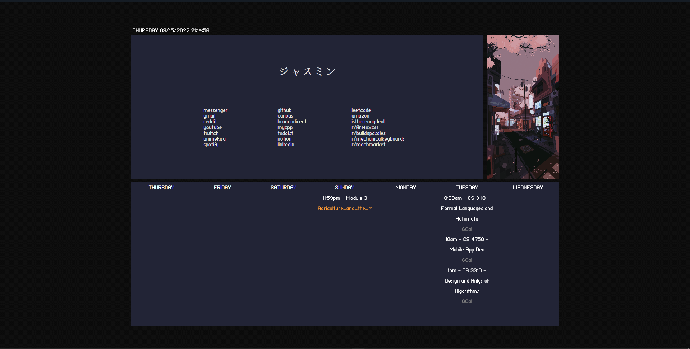

# My personalized Firefox start page

Built with:

- [Next.js](https://nextjs.org/)
- [styled-components](https://styled-components.com/)

Credits to [tayumpee](https://github.com/tayumpee/start_page2_firefox_and_chrome) for template.

## TODOS

1. Sort Todoist tasks displayed by soonest due date to latest due date.
2. Add component to display gif whenever a server error occurs.
